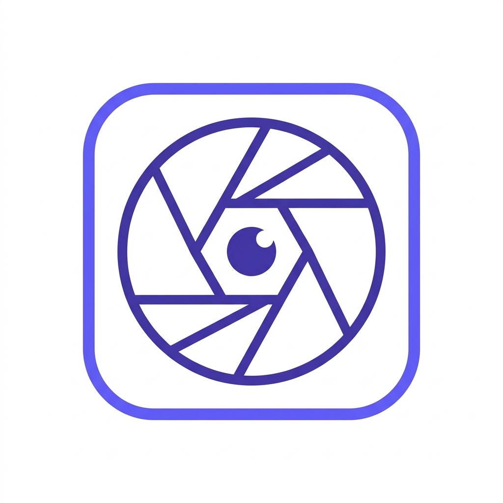

# Perceptible

<div align="center">
	<br/>
	<br/>
	
	<br/>
    Perceptible
	<br/>
	<br/>
</div>

Zero-dependency JavaScript library for high-performance DOM element viewability and visibility tracking.

> **Note:** Version 1 is purely in JavaScript, while version 2 supports TypeScript.

Perceptible monitors DOM elements in real time as users scroll and interact. It measures exact surface area coverage relative to the browser viewport while handling tab visibility, window focus events (`attentionMode`), and visibility duration.

Perceptible can be used to detect viewability of any DOM element that the user is currently looking at. A Element may be part of the page but not under current viewport (due to user scroll), perceptible helps to calculate viewability for such elements for analytics and other purpose.

In addition to view port, it also considers page focus and switching of tabs while calculating the visibility of element. Entire visibility duration of the element is also reported.

Perceptible is highly configurable and easy to use.

View the sample using `npm run sample`

[](https://github.com/anubhavsrivastava/perceptible/actions/workflows/ci.yml)
[](http://makeapullrequest.com)
[](https://github.com/anubhavsrivastava/perceptible/issues)

---

## Key Use Cases

- **Analytics & Impression Telemetry**: Track active impression duration for banner ads and content cards.
- **Ad Viewability Standards**: Measure MRC compliance (e.g. 50% visibility for >1 second).
- **A/B Testing & Content Engagement**: Quantify content exposure metrics.
- **Lazy Loading Triggers**: Trigger asset fetching when elements enter viewport bounds.
- **Media Player Automation**: Monitor visibility of video/audio elements to auto-pause or trigger Picture-in-Picture mode.

---

## Documentation

Full documentation is built with Docusaurus and available under the [`documentation`](documentation/docs) directory or hosted online at [`perceptible.js.org`](https://perceptible.js.org/).


## Usage with Packages (Example App)

For modern bundlers (like Vite, Webpack, or Rollup), you can import `perceptible` as an ESM/CommonJS module. 

### Basic Usage

```javascript
import Perceptor from 'perceptible';

const element = document.querySelector('#target');
const perceptor = new Perceptor(element, {
  threshold: 0.5 // trigger when 50% of the element is visible
});

perceptor.subscribe((event) => {
  console.log('Element visibility changed:', event);
});

perceptor.watch();
```

### TypeScript Support

Perceptible includes full, native TypeScript support out of the box. Types such as `SpectatorResult`, `SubView`, and config models are exported directly from the package:

```typescript
import Perceptor, { SpectatorResult, Config } from 'perceptible';

const element = document.querySelector('#target');
if (element) {
  const options: Partial<Config> = {
    threshold: 50,
    subscribers: [
      (instance: Perceptor, data: SpectatorResult) => {
        console.log('Visibility changed:', data.isVisible);
      }
    ]
  };

  const perceptor = new Perceptor(element, options);
  perceptor.watch();
}
```

### Running the Example Application

A complete Vite-based sample app demonstrating package usage is available in the [`example`](example) directory. To run it:

1. **Build the `perceptible` library** from the root directory:
   ```bash
   npm run build
   ```
2. **Navigate into the example directory**:
   ```bash
   cd example
   ```
3. **Install dependencies**:
   ```bash
   npm install
   ```
4. **Start the Vite development server**:
   ```bash
   npm run dev
   ```

---


## Development & Testing

This project uses Node.js (>=24) and Vite as its module bundler. For complete testing guidelines and agent instructions, refer to the [Testing Guide](TESTING.md).

### Installation & Scripts

```bash
# Install dependencies
npm install

# Build distribution bundle (Vite outputs dist/bundle.js and UMD/ESM modules)
npm run build

# Start dev build in watch mode
npm run start

# Run unit tests via Jest & jsdom
npm run test

# Run tests in watch mode / coverage
npm run test:watch
npm run test:coverage

# Run automated browser tests via Puppeteer
npm run test:e2e

# Serve interactive samples locally (runs http-server on /sample)
npm run sample

# Lint codebase
npm run lint
```

### Folder Structure

- `src` - Library source code (`config`, `schedulers`, `spectators`, `subscribers`, `utils`, unit tests)
- `example` - Modern Vite application consuming `perceptible` as an NPM module (`import Perceptor from 'perceptible'`)
- `e2e` - End-to-end automated browser test suite powered by Puppeteer
- `dist` - Compiled distribution bundles generated by Vite
- `documentation` - Modern documentation portal built with Docusaurus v3
- `media` - Graphical assets and logos
- `sample` - Standalone interactive HTML sample demonstrations consuming `dist/bundle.js`

---


## Contribution

Suggestions and Pull Requests are welcome! Please read the [contribution guidelines](CONTRIBUTING.md) to get started.

---

## License

[](LICENSE)

Released under the [MIT License](LICENSE).
