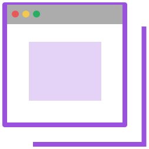

# Perceptible

	 
	 
	
	 
    Perceptible
	 
	 

A basic implementation to detect visibility of DOM Elements with Zero dependencies.

Perceptible can be used to detect viewability of any DOM element that the user is currently looking at. A Element may be part of the page but not under current viewport (due to user scroll), perceptible helps to calculate viewability for such elements for analytics and other purpose.

In addition to view port, it also considers page focus and switching of tabs while calculating the visibility of element. Entire visibility duration of the element is also reported.

Perceptible is highly configurable and easy to use.

View the sample using `npm run sample`

## Use Cases

-   Analytics
-   Ad viewability and audience engagement
-   A/B testing experiments
-   Lazy Loading
-   Video element time calculations

## Documentation

Entire documentation is available on [`perceptible.netlify.com`](https://perceptible.netlify.com/)

## Development

This project uses npm package manager and WebPack as bundler.

You may need to do `npm install` to get dependencies and `npm run build` to build latest bundle from webpack.
View the sample using `npm run sample`

Folder Structure:

-   `src` - Source code
-   `documentation` - Entire documentation using docusaurus
-   `media` - Media resources like graphics
-   `sample` - Sample using `build.js` from webpack in dist directory

## v1.0 roadmap:

-   [x] Framework with default Spectators
-   [x] Documentation
-   [ ] Unit Test Cases
-   [ ] Puppeteer Browser test

## Contribution

Suggestions and PRs are welcome!

Please read the [contribution guidelines](CONTRIBUTING.md) to get started.

---

## License

refer `LICENSE` file in this repository.

---
